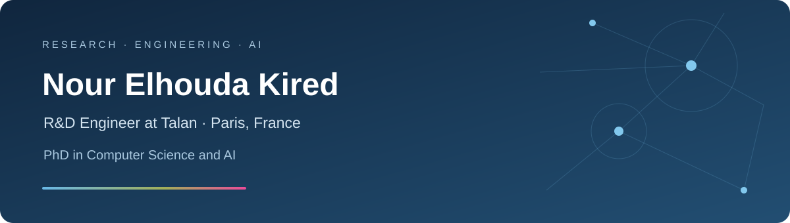

# Nour Elhouda Kired

  

  <a href="https://github.com/NourKired?tab=repositories">Explore my work</a> ·
  <a href="mailto:nada.kired@gmail.com">Get in touch</a>

## About

I'm Nour, an **R&D Engineer at Talan**, based in **Paris, France**, with a **PhD in Computer Science and AI**.

I connect AI research with practical software development: exploring ideas, building prototypes, and evaluating what works.

## Research notebook

| Focus | What I explore |
| :--- | :--- |
| 🧠 Artificial intelligence | Deep learning and applied machine learning |
| 🔎 Data understanding | Personal data detection in heterogeneous datasets |
| 💬 Conversational AI | Adaptive interactions and AI maturity assessment |

## From research to code

**Model & experiment**  
`Python` · `PyTorch` · `TensorFlow` · `scikit-learn` · `Pandas`

**Connect & explore**  
`Neo4j` · `Elasticsearch` · `Kibana`

**Build & share**  
`Docker` · `Git`

---

<em>Research, experimentation, and useful software.</em>

